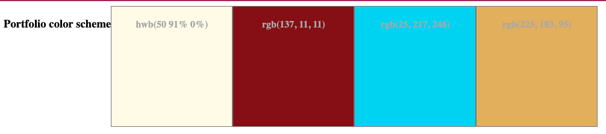
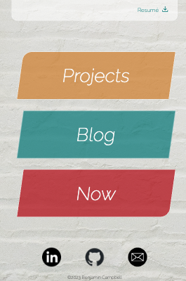
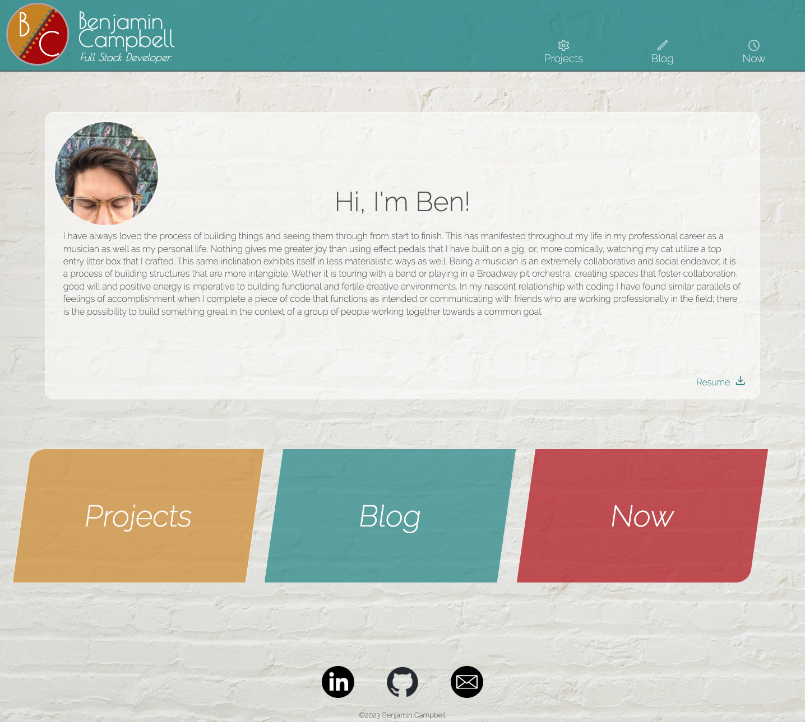
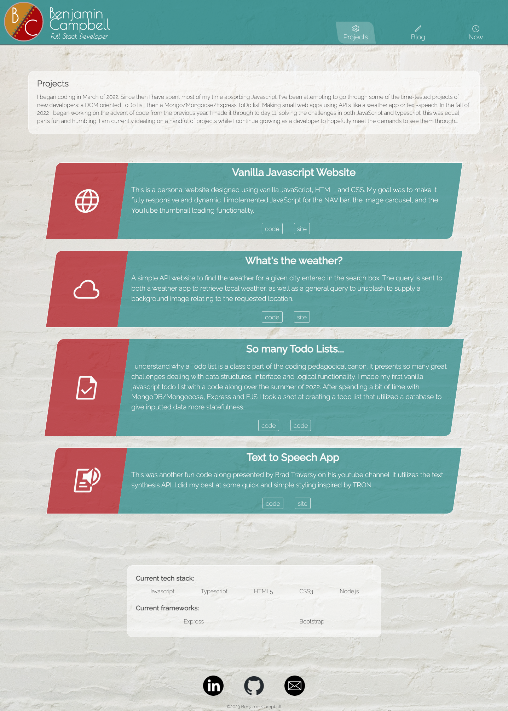
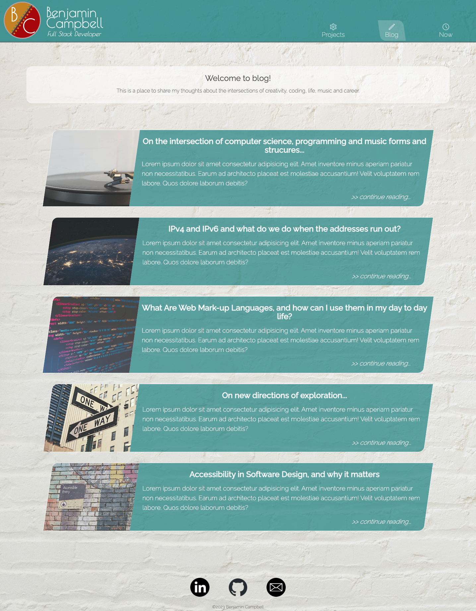
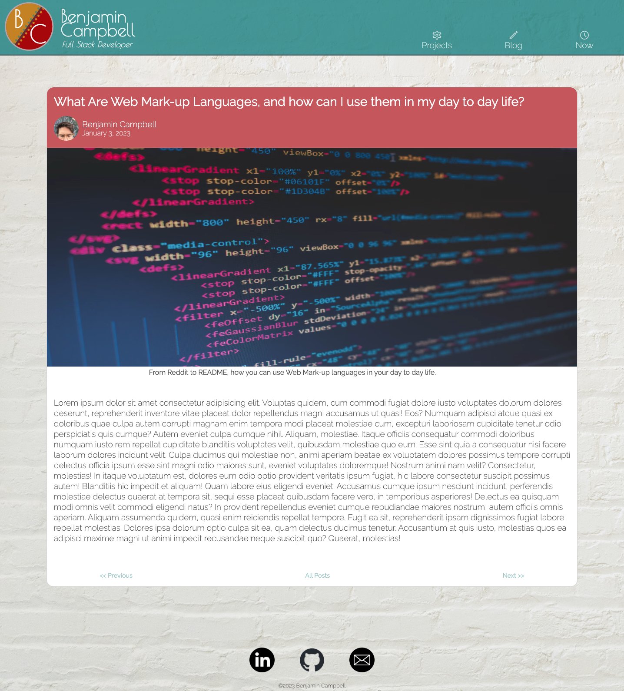
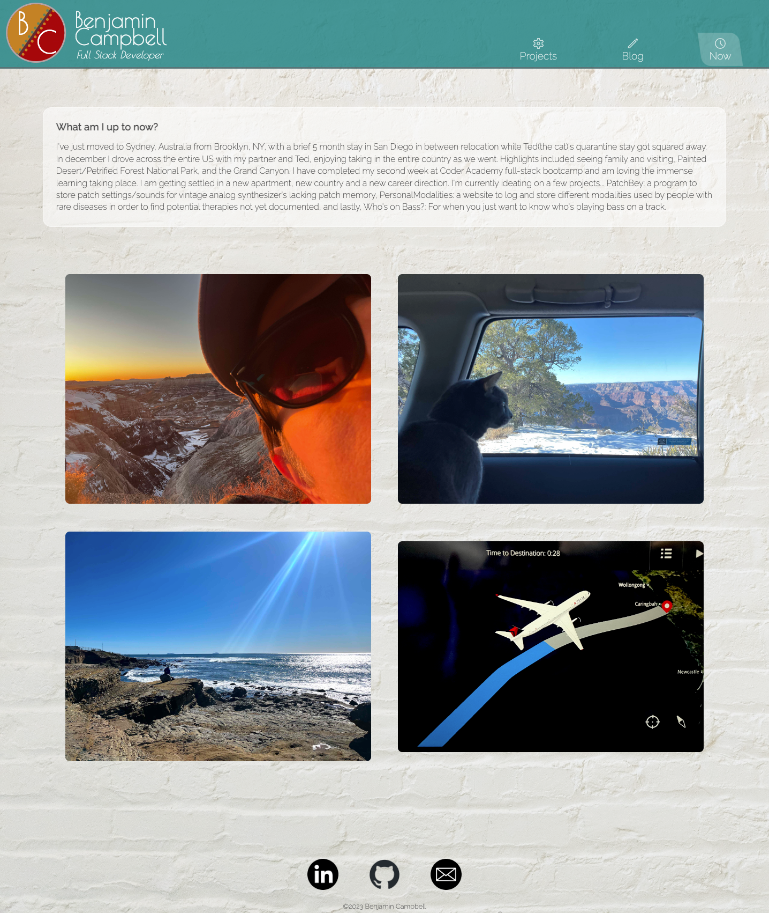

# README
## Benjamin Campbell 
### Assignment T1_A2: Portfolio Project    
&nbsp;
### [Website](https://benjamin-campbell-t1-a2.vercel.app/)
### [Github Repo](https://github.com/bccbass/BenjaminCampbell_T1A2/tree/main/src)
### [Video Presentation](https://www.youtube.com/watch?v=2es7_0BvgrQ)
&nbsp;


### *Concept and Themes*
In creating this website I endeavor to present myself as a capable and clever developer to prospective employers and fellow programmers alike. It is my hope that concisely convey my strengths and my personality in the most clear manner possible. The aesthetics were inspired by the trip I took across the United States when I moved from Brooklyn to San Diego before coming to Australia. The southwest left an indelible impression on me, with its muted yet vivid colors, vast open expanses, and lack of inorganic sound. This dictated my color palette and mood board.




&nbsp;
### *Sitemap*
 It was my goal to make clear functionality with a clean site flow. I attempted to group specific concerns to their own pages, leading the visitor to each specific area for further exploration. 


&nbsp;
### *Design Components*
I chose to use a wave design on the elements like headings and active page indicators in the NAV bar to present a feeling of flowing energy. I accomplished this by using the ``` skew() ``` property on select elements, then skewing the inner text elements back to their proper orientation when necessary. This also served as a unifying style design throughout the website which provided aesthetic continuity.





The addition of a ‘Now’ page serves to give a snapshot in time of what I'm up to at the current moment in a way that a tweet or Instagram post cannot. 

I also chose to create a more self contained blog section, with an index listing titles, and individual pages for each post, navigable to previous and next posts. 

In an effort to save time/code I used reusable styling classes -  this seemed to help further thematic continuity.

&nbsp;
### *Tech Stack*
Although I was tempted at times to use JavaScript for extended functionality and layout, I stuck to using pure HTML and CSS. This was a welcome challenge that forced me to grow my skills and find creative solutions for the problems that I encountered. 

&nbsp;
&nbsp;
&nbsp;
## *Website Screenshots:*
### Index

&nbsp;

### Projects

&nbsp;

### Blog Index

&nbsp;

### Blog Post

&nbsp;

### Now

